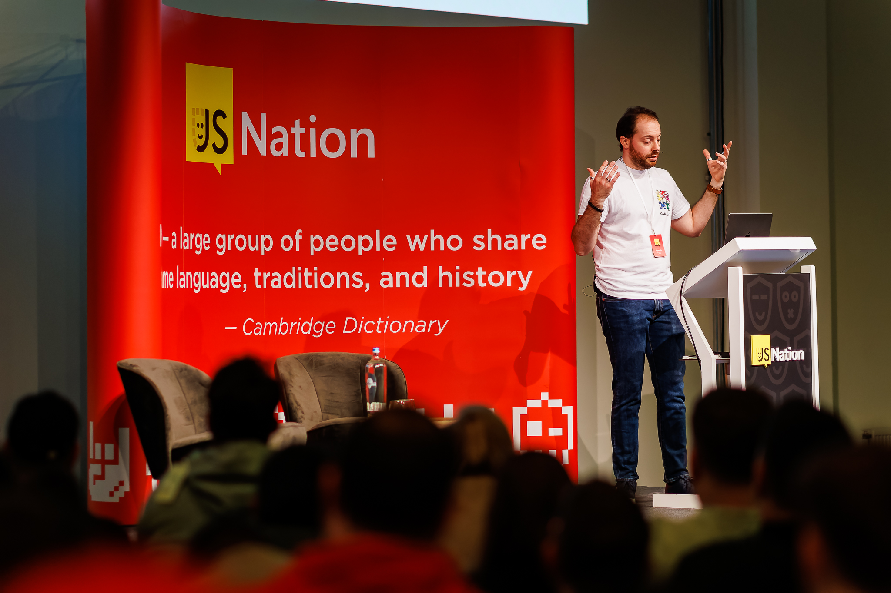

We are happy to announce Biome, _toolchain of the web_.

Biome is the **official** fork of Rome and it will continue to be Rome's legacy.

Biome is **led and maintained** by the same people that maintained Rome so far.

**Follow us**:

- [Github organization](https://github.com/biomejs)
- [Official repository](https://github.com/biomejs/biome)
- [Official discord server](https://discord.gg/BypW39g6Yc)
- [Official twitter account](https://twitter.com/biomejs)

## Background

I want to give you some background and context, which could help you to get why the core team created a new project with a new name. If you're not interested, feel free to jump to the [next section](#enters-biome)

### How it started

Before explaining the reasons for the fork, I'd like to give you some background and context; this would help you understand the reasons
that led to this decision.

When I [joined](https://github.com/rome/tools/pull/794) the Rome project; the project was still young and written in [TypeScript](https://github.com/rome/tools/tree/archived-js).
A long time passed, and the project underwent many transitions.

Rome was initially released and licensed under the Meta OSS umbrella. Meta is an excellent incubator for OSS projects, but some people didn't like it. At least, my impression was that they didn't.

The npm package `rome` belonged to another person, so when ownership changed, there were already a lot of version numbers used. The team always struggled with versioning. It shouldn't be hard to version a software!

After a few months, the project got out of Meta's OSS umbrella. In six months, the creator Sebastian McKenzie created the company Rome Tools Inc., to keep working on the Rome project so to eventually became sustainable.

I was excited about the news because I believed in Rome's mission, so I decided to quit my job and join the adventure. In a few weeks, I joined Rome Tools Inc. as
a full-time employee to work on developer tools as my daily job. For me, it was like a dream coming true!

### How it ended (or did it?)

Not all startups manage to succeed, and Rome Tools Inc. wasn't one of the lucky ones. Eventually, all the employees were laid off.

My adventure with Rome Tools Inc. sadly ended, but fortunately, my career working with developer tools continued! A few months later, I joined the [Astro Technology Company](https://astro.build/) working full-time. It's a great place to work, and I get to do what I love every day with fantastic people. I love it!

Part of me was still charmed by Rome's mission though. However, it wasn't just that. I like working on parsers/compilers in my free time. I **love** the [Rust](https://www.rust-lang.org/) language, and Rome is the perfect OSS project where I can use it.

So, in my free time, I continued with my contributions to Rome as much as possible; luckily, I still had some rights that allowed me to publish new versions of the project. Despite the unsuccessful adventure with Rome Tools Inc., I wanted to keep the project alive.

A few new [OSS contributors](#the-core-team) joined the cause and helped in contributing to the project. I wasn't alone, and that's the great thing about OSS. You eventually find people who like the project and want to contribute too.

In June, I [gave a talk](https://portal.gitnation.org/contents/rome-a-modern-toolchain) about Rome at JsNation 2023.



So, the project is still alive, but maintaining it has become challenging:

- I don't have admin rights on Discord, so I can't delegate moderation rights to other people;
- I don't have access to the hosting platform of the website;
- I don't have access to any registry (npm, VSCode, etc.);
- the project is still under the MIT license of Rome Tools Inc., which makes attributions and contributions seem foggy from a legal point of view (where's the company? I don't know).

Many attempts to reach out to the current owner were all void. There was only one thing I could do. **[We could do](#the-core-team).**

## Enters: Biome

We created Biome. After weeks of discussions among the members of the core team and conversations with some friends, we thought that a clean slate was the best course of action.

We pondered the idea of keeping the "rome" name in the new fork, but that was proven difficult:

- Sebastian has registered tons of stuff with the "rome" name (GitHub organizations, website domains, open collectives, npm organizations). Finding the right combination wasn't easy;
- without the proper rights in the Discord server, we couldn't delegate the moderation rights. Discord is a very important asset for community building;
- keeping the name would have caused some attribution to Rome Tools Inc., making things still foggy when it comes to the legal aspects of the source code;
- we don't know if the "rome" name is registered; if it turns out it is, we could have incurred some legal troubles;
- "Rome" has a lot of historical baggage, as explained before (Meta and, fail as a startup);

Given all these difficulties, the core team settled for a new project.

### "New is always better."

<div style={{ minWidth: "200px" }}>
  
</div>

Biome will embrace the same [philosophy](https://biomejs.dev/internals/philosophy) of the old Rome and the same mission. Although, the roadmap will likely change, and the core team could decide to focus on making the current features more stable instead of releasing new ones.

Still, the primary mission is alive, and Biome wants to be a 360° toolchain; we recently started working on **transformations**, which will eventually set up the foundations of the compiler.

### Why Biome

The team wanted to create a second "Rome", a second version of it. So we fused the words "Bis" and "Rome". \*\*Biome"".

## I still use the `rome` package. What should I do?

The `rome` package **_won't be maintained anymore_** by the core team, so you won't get any more releases.

1. You should use the `@biomejs/biome` package. Note that Biome also comes with a lot of new features and fixes. We've just prepared a [blog post](/blog/biome-v1) for that.

   ```diff
   {
   -  "rome": "12.1.3"
   +  "@biomejs/biome": "1.0.0"
   }
   ```

2. And change the CLI name in your scripts:
   ```diff
   {
     "scripts": {
   -    "format": "rome format --write ./src",
   +    "format": "biome format --write ./src"
     }
   }
   ```
3. In your `rome.json` file, update the URL of the `$schema` field:

   ```diff
   {
   -  "$schema": "https://docs.rome.tools/schemas/12.1.3/schema.json",
   +  "$schema": "https://biomejs.dev/schemas/1.0.0/schema.json"
   }
   ```

4. Then install the new official [VSCode](https://marketplace.visualstudio.com/items?itemName=biomejs.biome) or [open VSX](https://open-vsx.org/extension/biomejs/biome) extension. That's an important step if you use these extensions.

5. After the installation of the extension, open the `settings.json`. If you have some Rome related settings there, you'll have to update them:

   ```diff
   {
     "[javascript]": {
   -		"editor.defaultFormatter": "rome.rome"
   +		"editor.defaultFormatter": "biomejs.biome"
     },
     "editor.codeActionsOnSave": {
   -    "quickfix.rome": true,
   -    "source.organizeImports.rome": true
   +    "quickfix.biome": true,
   +    "source.organizeImports.biome": true
     }
   }
   ```

Biome **still accepts the `rome.json` file** as a configuration, so you don't need to do anything yet. Biome also takes `biome.json` as a configuration file.

We will eventually sunset the `rome.json` configuration file for `biome.json`, but Biome will do that for you in the subsequent releases. So, don't worry about updating everything unless you want to.

## The core team

- [Emanuele Stoppa](https://github.com/ematipico): me, the lead of the project 🤓
- [Denis Bezrukov](https://github.com/denbezrukov): Denis has contributed to the project for a long time He made contributions to many tools like formatter and parser;
- [Victorien Elvinger](https://github.com/Conaclos): Victorien is very passionate, and he's made tons of contributions to the Biome linter by creating new rules and optimising the ones that were already there when he joined;
- [Daiki Nishikawa](https://github.com/nissy-dev): Daiki worked on linter and parser, by adding new rules, fixing the existing ones, improving the internal semantic model, and adding new grammar to the JavaScript/TypeScript parser;
- [unvalley](https://github.com/unvalley): unvalley added a lot of value to the linter and parser. They tackled some complex rules, for example, especially the ones around regex;

## Special thanks

- [Strager](https://github.com/strager): his inputs and constructive criticisms to the project are what helped Biome to arrive to this point;
- [Boshen](https://github.com/Boshen): one of the greatest admirers of the project since the Rust rewrite; he joined the Biome community to learn from us and contribute as much as possible. He now leads a similar project to Biome, [oxc](https://github.com/web-infra-dev/oxc). Check it out.
- [Micha](https://github.com/MichaReiser): ex-employee of Rome Tools Inc., he is now a full-time developer of the project [Ruff](https://github.com/astral-sh/ruff), he gave a lot of good pieces of advice, and he was a good listener when I was struggling to make the right decisions.

## Translations

- [中文翻译: 宣布 Biome](https://juejin.cn/post/7308539123538608165)
