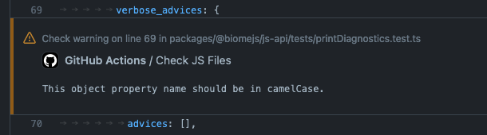

Along with the [Roadmap for 2024](/blog/roadmap-2024), the [new logo and homepage](/blog/roadmap-2024#new-logo-and-homepage), we also published a new version. This version has few features around the CLI and **many** fixes in our formatter. Our TypeScript, JSX and JavaScript formatting has surpassed the **97% compatibility rate** with Prettier. Biome now provides **over 190 lint rules**.

Update Biome using the following commands:

```shell
npm install --save-dev --save-exact @biomejs/biome@latest
npx @biomejs/biome migrate
```

## New features

- Process only the files that were changed.
- The command `biome ci` now prints diagnostics in GitHub PRs.
- A new command,`biome explain`.
- The command `biome migrate` updates the `$schema`.
- New lint rules.

### Process only the files that were changed

If you enable the integration with VCS, you can tell Biome to process only the files that were changed. As for now, this feature computes the files that were changed by using a VCS, so Biome doesn't know exactly which lines changed.

This feature practically makes some utilities such as `lint-staged` obsolete.

To take advantage of this feature, you have to tell Biome what's the default branch in the configuration file, and then you'll have to pass the option `--changed` via CLI:

```json title="biome.json" ins={5}
{
  "vcs": {
    "enabled": true,
    "clientKind": "git",
    "defaultBranch": "main"
  }
}
```

Once you modified some files, use the new option to the command you need, for example the `format` command:

```shell ins="--changed"
biome format --changed --write
```

### The command `biome ci` now prints diagnostics in GitHub PRs

For quite some time, users were confused by the difference between the commands `check` and `ci`because, until now, their behaviours have been very similar. From this version, the command `ci` can detect the GitHub CI environment and print annotation in the PRs.



It's possible that you would need to change your permissions of your workflow files in case you don't see the annotations:

```yaml title=".github/workflows/action.yml"
permissions:
  pull-requests: write
```

### A new command `biome explain`

This command will serve as an "offline" documentation tool. In this release, the command supports the explanation of all the lint rules; for example you can request documentation for `noAccumulatingSpread`:

```shell
biome explain noAccumulatingSpread
```

Which will print the following Markdown:

``````markdown
# noAccumulatingSpread

No fix available.

This rule is recommended.

# Description
Disallow the use of spread (`...`) syntax on accumulators.

Spread syntax allows an iterable to be expanded into its individual elements.

Spread syntax should be avoided on accumulators (like those in `.reduce`)
because it causes a time complexity of `O(n^2)` instead of `O(n)`.

Source: https://prateeksurana.me/blog/why-using-object-spread-with-reduce-bad-idea/

## Examples

### Invalid

```js,expect_diagnostic
var a = ['a', 'b', 'c'];
a.reduce((acc, val) => [...acc, val], []);
```

```js,expect_diagnostic
var a = ['a', 'b', 'c'];
a.reduce((acc, val) => {return [...acc, val];}, []);
```

```js,expect_diagnostic
var a = ['a', 'b', 'c'];
a.reduce((acc, val) => ({...acc, [val]: val}), {});
```

## Valid

```js
var a = ['a', 'b', 'c'];
a.reduce((acc, val) => {acc.push(val); return acc}, []);
```

``````

We plan to make this output more readable for terminals, as well as provide autocompletion for this command.

#### The command `biome migrate` updates the `$schema`

The command `biome migrate` now updates the `$schema` value inside the configuration file `biome.json` if you avail of the online schema. Run this command as soon as you update to Biome `v1.5.0`:

```json title="biome.json" ins="1.5.0" del={2} ins={3}
{
  "$schema": "https://biomejs.dev/schemas/1.4.1/schema.json"
  "$schema": "https://biomejs.dev/schemas/1.5.0/schema.json"
}
```

### New rules

####  [useExportType](https://biomejs.dev/linter/rules/use-export-type)

```ts
interface I {}
export { I };
```

<pre class="language-text"><code class="language-text">nursery/useExportType.js:2:8 <a href="https://biomejs.dev/linter/rules/use-export-type">lint/nursery/useExportType</a> <span style="color: #000; background-color: #ddd;"> FIXABLE </span> ━━━━━━━━━━━━━━━━━━━━━━━━━━━━━━━━━━

<strong><span style="color: Tomato;">  </span></strong><strong><span style="color: Tomato;">✖</span></strong> <span style="color: Tomato;">All exports are only types and should thus use </span><span style="color: Tomato;"><strong>export type</strong></span><span style="color: Tomato;">.</span>

    <strong>1 │ </strong>interface I {}
<strong><span style="color: Tomato;">  </span></strong><strong><span style="color: Tomato;">&gt;</span></strong> <strong>2 │ </strong>export { I };
   <strong>   │ </strong>       <strong><span style="color: Tomato;">^</span></strong><strong><span style="color: Tomato;">^</span></strong><strong><span style="color: Tomato;">^</span></strong><strong><span style="color: Tomato;">^</span></strong><strong><span style="color: Tomato;">^</span></strong><strong><span style="color: Tomato;">^</span></strong>
    <strong>3 │ </strong>

<strong><span style="color: lightgreen;">  </span></strong><strong><span style="color: lightgreen;">ℹ</span></strong> <span style="color: lightgreen;">Using </span><span style="color: lightgreen;"><strong>export type</strong></span><span style="color: lightgreen;"> allows transpilers to safely drop exports of types without looking for their definition.</span>

<strong><span style="color: lightgreen;">  </span></strong><strong><span style="color: lightgreen;">ℹ</span></strong> <span style="color: lightgreen;">Safe fix</span><span style="color: lightgreen;">: </span><span style="color: lightgreen;">Use a grouped </span><span style="color: lightgreen;"><strong>export type</strong></span><span style="color: lightgreen;">.</span>

<strong>  </strong><strong>  2 │ </strong>export<span style="opacity: 0.8;">·</span><span style="color: MediumSeaGreen;">t</span><span style="color: MediumSeaGreen;">y</span><span style="color: MediumSeaGreen;">p</span><span style="color: MediumSeaGreen;">e</span><span style="opacity: 0.8;"><span style="color: MediumSeaGreen;">·</span></span>{<span style="opacity: 0.8;">·</span>I<span style="opacity: 0.8;">·</span>};
<strong>  </strong><strong>    │ </strong>       <span style="color: MediumSeaGreen;">+</span><span style="color: MediumSeaGreen;">+</span><span style="color: MediumSeaGreen;">+</span><span style="color: MediumSeaGreen;">+</span><span style="color: MediumSeaGreen;">+</span>
</code></pre>

####  [useImportType](https://biomejs.dev/linter/rules/use-import-type)

```ts
import { A } from "./mod.js";
type TypeOfA = typeof A;
let a: A;
```

<pre class="language-text"><code class="language-text">nursery/useImportType.js:1:1 <a href="https://biomejs.dev/linter/rules/use-import-type">lint/nursery/useImportType</a> <span style="color: #000; background-color: #ddd;"> FIXABLE </span> ━━━━━━━━━━━━━━━━━━━━━━━━━━━━━━━━━━

<strong><span style="color: Tomato;">  </span></strong><strong><span style="color: Tomato;">✖</span></strong> <span style="color: Tomato;">All these imports are only used as types.</span>

<strong><span style="color: Tomato;">  </span></strong><strong><span style="color: Tomato;">&gt;</span></strong> <strong>1 │ </strong>import { A } from &quot;./mod.js&quot;;
   <strong>   │ </strong><strong><span style="color: Tomato;">^</span></strong><strong><span style="color: Tomato;">^</span></strong><strong><span style="color: Tomato;">^</span></strong><strong><span style="color: Tomato;">^</span></strong><strong><span style="color: Tomato;">^</span></strong><strong><span style="color: Tomato;">^</span></strong><strong><span style="color: Tomato;">^</span></strong><strong><span style="color: Tomato;">^</span></strong><strong><span style="color: Tomato;">^</span></strong><strong><span style="color: Tomato;">^</span></strong><strong><span style="color: Tomato;">^</span></strong><strong><span style="color: Tomato;">^</span></strong><strong><span style="color: Tomato;">^</span></strong><strong><span style="color: Tomato;">^</span></strong><strong><span style="color: Tomato;">^</span></strong><strong><span style="color: Tomato;">^</span></strong><strong><span style="color: Tomato;">^</span></strong><strong><span style="color: Tomato;">^</span></strong><strong><span style="color: Tomato;">^</span></strong><strong><span style="color: Tomato;">^</span></strong><strong><span style="color: Tomato;">^</span></strong><strong><span style="color: Tomato;">^</span></strong><strong><span style="color: Tomato;">^</span></strong><strong><span style="color: Tomato;">^</span></strong><strong><span style="color: Tomato;">^</span></strong><strong><span style="color: Tomato;">^</span></strong><strong><span style="color: Tomato;">^</span></strong><strong><span style="color: Tomato;">^</span></strong><strong><span style="color: Tomato;">^</span></strong>
    <strong>2 │ </strong>type TypeOfA = typeof A;
    <strong>3 │ </strong>let a: A;

<strong><span style="color: lightgreen;">  </span></strong><strong><span style="color: lightgreen;">ℹ</span></strong> <span style="color: lightgreen;">Importing the types with </span><span style="color: lightgreen;"><strong>import type</strong></span><span style="color: lightgreen;"> ensures that they are removed by the transpilers and avoids loading unnecessary modules.</span>

<strong><span style="color: lightgreen;">  </span></strong><strong><span style="color: lightgreen;">ℹ</span></strong> <span style="color: lightgreen;">Safe fix</span><span style="color: lightgreen;">: </span><span style="color: lightgreen;">Use </span><span style="color: lightgreen;"><strong>import type</strong></span><span style="color: lightgreen;">.</span>

<strong>  </strong><strong>  1 │ </strong>import<span style="opacity: 0.8;">·</span><span style="color: MediumSeaGreen;">t</span><span style="color: MediumSeaGreen;">y</span><span style="color: MediumSeaGreen;">p</span><span style="color: MediumSeaGreen;">e</span><span style="opacity: 0.8;"><span style="color: MediumSeaGreen;">·</span></span>{<span style="opacity: 0.8;">·</span>A<span style="opacity: 0.8;">·</span>}<span style="opacity: 0.8;">·</span>from<span style="opacity: 0.8;">·</span>&quot;./mod.js&quot;;
<strong>  </strong><strong>    │ </strong>       <span style="color: MediumSeaGreen;">+</span><span style="color: MediumSeaGreen;">+</span><span style="color: MediumSeaGreen;">+</span><span style="color: MediumSeaGreen;">+</span><span style="color: MediumSeaGreen;">+</span>
</code></pre>

####  [useFilenamingConvention](https://biomejs.dev/linter/rules/use-filenaming-convention)

Enforces naming conventions for JavaScript and TypeScript filenames.

#### [useNodejsImportProtocol](https://biomejs.dev/linter/rules/use-nodejs-import-protocol)

```jsx
import fs from 'fs';
```


<pre class="language-text"><code class="language-text">nursery/useNodejsImportProtocol.js:1:16 <a href="https://biomejs.dev/linter/rules/use-node-import-protocol">lint/nursery/useNodejsImportProtocol</a> <span style="color: #000; background-color: #ddd;"> FIXABLE </span> ━━━━━━━━━━━━━━━━━

<strong><span style="color: Orange;">  </span></strong><strong><span style="color: Orange;">⚠</span></strong> <span style="color: Orange;">Import from Node.js builtin module &quot;</span><span style="color: Orange;"><strong>fs</strong></span><span style="color: Orange;">&quot; should use the &quot;</span><span style="color: Orange;"><strong>node:</strong></span><span style="color: Orange;">&quot; protocol.</span>

<strong><span style="color: Tomato;">  </span></strong><strong><span style="color: Tomato;">&gt;</span></strong> <strong>1 │ </strong>import fs from 'fs';
   <strong>   │ </strong>               <strong><span style="color: Tomato;">^</span></strong><strong><span style="color: Tomato;">^</span></strong><strong><span style="color: Tomato;">^</span></strong><strong><span style="color: Tomato;">^</span></strong>
    <strong>2 │ </strong>

<strong><span style="color: lightgreen;">  </span></strong><strong><span style="color: lightgreen;">ℹ</span></strong> <span style="color: lightgreen;">Using the </span><span style="color: lightgreen;"><strong>node:</strong></span><span style="color: lightgreen;"> protocol is more explicit and signals that the imported module belongs to Node.js.</span>

<strong><span style="color: lightgreen;">  </span></strong><strong><span style="color: lightgreen;">ℹ</span></strong> <span style="color: lightgreen;">Unsafe fix</span><span style="color: lightgreen;">: </span><span style="color: lightgreen;">Change to &quot;node:fs&quot;.</span>

    <strong>1</strong>  <strong> │ </strong><span style="color: Tomato;">-</span> <span style="color: Tomato;">i</span><span style="color: Tomato;">m</span><span style="color: Tomato;">p</span><span style="color: Tomato;">o</span><span style="color: Tomato;">r</span><span style="color: Tomato;">t</span><span style="color: Tomato;"><span style="opacity: 0.8;">·</span></span><span style="color: Tomato;">f</span><span style="color: Tomato;">s</span><span style="color: Tomato;"><span style="opacity: 0.8;">·</span></span><span style="color: Tomato;">f</span><span style="color: Tomato;">r</span><span style="color: Tomato;">o</span><span style="color: Tomato;">m</span><span style="color: Tomato;"><span style="opacity: 0.8;">·</span></span><span style="color: Tomato;"><strong>'</strong></span><span style="color: Tomato;"><strong>f</strong></span><span style="color: Tomato;"><strong>s</strong></span><span style="color: Tomato;"><strong>'</strong></span><span style="color: Tomato;">;</span>
      <strong>1</strong><strong> │ </strong><span style="color: MediumSeaGreen;">+</span> <span style="color: MediumSeaGreen;">i</span><span style="color: MediumSeaGreen;">m</span><span style="color: MediumSeaGreen;">p</span><span style="color: MediumSeaGreen;">o</span><span style="color: MediumSeaGreen;">r</span><span style="color: MediumSeaGreen;">t</span><span style="color: MediumSeaGreen;"><span style="opacity: 0.8;">·</span></span><span style="color: MediumSeaGreen;">f</span><span style="color: MediumSeaGreen;">s</span><span style="color: MediumSeaGreen;"><span style="opacity: 0.8;">·</span></span><span style="color: MediumSeaGreen;">f</span><span style="color: MediumSeaGreen;">r</span><span style="color: MediumSeaGreen;">o</span><span style="color: MediumSeaGreen;">m</span><span style="color: MediumSeaGreen;"><span style="opacity: 0.8;">·</span></span><span style="color: MediumSeaGreen;"><strong>&quot;</strong></span><span style="color: MediumSeaGreen;"><strong>n</strong></span><span style="color: MediumSeaGreen;"><strong>o</strong></span><span style="color: MediumSeaGreen;"><strong>d</strong></span><span style="color: MediumSeaGreen;"><strong>e</strong></span><span style="color: MediumSeaGreen;"><strong>:</strong></span><span style="color: MediumSeaGreen;"><strong>f</strong></span><span style="color: MediumSeaGreen;"><strong>s</strong></span><span style="color: MediumSeaGreen;"><strong>&quot;</strong></span><span style="color: MediumSeaGreen;">;</span>
    <strong>2</strong> <strong>2</strong><strong> │ </strong>

</code></pre>

#### [noNodejsModules](https://biomejs.dev/linter/rules/no-nodejs-modules)

```jsx
import fs from "fs";
import path from "node:path";
```

<pre class="language-text"><code class="language-text">nursery/noNodejsModules.js:1:16 <a href="https://biomejs.dev/linter/rules/no-nodejs-modules">lint/nursery/noNodejsModules</a> ━━━━━━━━━━━━━━━━━━━━━━━━━━━━━━━━━━━━━━━

<strong><span style="color: Orange;">  </span></strong><strong><span style="color: Orange;">⚠</span></strong> <span style="color: Orange;">Using Node.js modules are forbidden.</span>

<strong><span style="color: Tomato;">  </span></strong><strong><span style="color: Tomato;">&gt;</span></strong> <strong>1 │ </strong>import fs from &quot;fs&quot;;
   <strong>   │ </strong>               <strong><span style="color: Tomato;">^</span></strong><strong><span style="color: Tomato;">^</span></strong><strong><span style="color: Tomato;">^</span></strong><strong><span style="color: Tomato;">^</span></strong>
    <strong>2 │ </strong>import path from &quot;node:path&quot;;
    <strong>3 │ </strong>

<strong><span style="color: lightgreen;">  </span></strong><strong><span style="color: lightgreen;">ℹ</span></strong> <span style="color: lightgreen;">Can be useful for client-side web projects that do not have access to those modules.</span>

<strong><span style="color: lightgreen;">  </span></strong><strong><span style="color: lightgreen;">ℹ</span></strong> <span style="color: lightgreen;">Remove the import module.</span>

</code></pre>

#### [noInvalidUseBeforeDeclaration](https://biomejs.dev/linter/rules/no-invalid-use-before-declaration)

```jsx
function f() {
    console.log(x);
    const x;
}
```

<pre class="language-text"><code class="language-text">nursery/noInvalidUseBeforeDeclaration.js:3:11 parse ━━━━━━━━━━━━━━━━━━━━━━━━━━━━━━━━━━━━━━━━━━━━━━━━

<strong><span style="color: Tomato;">  </span></strong><strong><span style="color: Tomato;">✖</span></strong> <span style="color: Tomato;">Const declarations must have an initialized value.</span>

    <strong>1 │ </strong>function f() {
    <strong>2 │ </strong>    console.log(x);
<strong><span style="color: Tomato;">  </span></strong><strong><span style="color: Tomato;">&gt;</span></strong> <strong>3 │ </strong>    const x;
   <strong>   │ </strong>          <strong><span style="color: Tomato;">^</span></strong>
    <strong>4 │ </strong>}
    <strong>5 │ </strong>

<strong><span style="color: lightgreen;">  </span></strong><strong><span style="color: lightgreen;">ℹ</span></strong> <span style="color: lightgreen;">This variable needs to be initialized.</span>

</code></pre>

#### [noGlobalEval](https://biomejs.dev/linter/rules/no-global-eval)

```jsx
eval("var a = 0");
```

<pre class="language-text"><code class="language-text">nursery/noGlobalEval.js:1:1 <a href="https://biomejs.dev/linter/rules/no-global-eval">lint/nursery/noGlobalEval</a> ━━━━━━━━━━━━━━━━━━━━━━━━━━━━━━━━━━━━━━━━━━━━━━

<strong><span style="color: Tomato;">  </span></strong><strong><span style="color: Tomato;">✖</span></strong> <span style="color: Tomato;"><strong>eval()</strong></span><span style="color: Tomato;"> exposes to security risks and performance issues.</span>

<strong><span style="color: Tomato;">  </span></strong><strong><span style="color: Tomato;">&gt;</span></strong> <strong>1 │ </strong>eval(&quot;var a = 0&quot;);
   <strong>   │ </strong><strong><span style="color: Tomato;">^</span></strong><strong><span style="color: Tomato;">^</span></strong><strong><span style="color: Tomato;">^</span></strong><strong><span style="color: Tomato;">^</span></strong>
    <strong>2 │ </strong>

<strong><span style="color: lightgreen;">  </span></strong><strong><span style="color: lightgreen;">ℹ</span></strong> <span style="color: lightgreen;">See the </span><span style="color: lightgreen;"><a href="https://developer.mozilla.org/en-US/docs/Web/JavaScript/Reference/Global_Objects/eval#never_use_eval!">MDN web docs</a></span><span style="color: lightgreen;"> for more details.</span>

<strong><span style="color: lightgreen;">  </span></strong><strong><span style="color: lightgreen;">ℹ</span></strong> <span style="color: lightgreen;">Refactor the code so that it doesn't need to call </span><span style="color: lightgreen;"><strong>eval()</strong></span><span style="color: lightgreen;">.</span>

</code></pre>

#### [noGlobalAssign](https://biomejs.dev/linter/rules/no-global-assign)

```jsx
Object = null;
```

<pre class="language-text"><code class="language-text">nursery/noGlobalAssign.js:1:1 <a href="https://biomejs.dev/linter/rules/no-global-assign">lint/nursery/noGlobalAssign</a> ━━━━━━━━━━━━━━━━━━━━━━━━━━━━━━━━━━━━━━━━━━

<strong><span style="color: Tomato;">  </span></strong><strong><span style="color: Tomato;">✖</span></strong> <span style="color: Tomato;">A global variable should not be reassigned.</span>

<strong><span style="color: Tomato;">  </span></strong><strong><span style="color: Tomato;">&gt;</span></strong> <strong>1 │ </strong>Object = null;
   <strong>   │ </strong><strong><span style="color: Tomato;">^</span></strong><strong><span style="color: Tomato;">^</span></strong><strong><span style="color: Tomato;">^</span></strong><strong><span style="color: Tomato;">^</span></strong><strong><span style="color: Tomato;">^</span></strong><strong><span style="color: Tomato;">^</span></strong><strong><span style="color: Tomato;">^</span></strong>
    <strong>2 │ </strong>

<strong><span style="color: lightgreen;">  </span></strong><strong><span style="color: lightgreen;">ℹ</span></strong> <span style="color: lightgreen;">Assigning to a global variable can override essential functionality.</span>

</code></pre>

#### [noMisleadingCharacterClass](https://biomejs.dev/linter/rules/no-misleading-character-class)

```jsx
/^[Á]$/u;
```

<pre class="language-text"><code class="language-text">nursery/noMisleadingCharacterClass.js:1:1 <a href="https://biomejs.dev/linter/rules/no-misleading-character-class">lint/nursery/noMisleadingCharacterClass</a> ━━━━━━━━━━━━━━━━━━

<strong><span style="color: Orange;">  </span></strong><strong><span style="color: Orange;">⚠</span></strong> <span style="color: Orange;">Unexpected combined character in the character class.</span>

<strong><span style="color: Tomato;">  </span></strong><strong><span style="color: Tomato;">&gt;</span></strong> <strong>1 │ </strong>/^[Á]$/u;
   <strong>   │ </strong><strong><span style="color: Tomato;">^</span></strong><strong><span style="color: Tomato;">^</span></strong><strong><span style="color: Tomato;">^</span></strong><strong><span style="color: Tomato;">^</span></strong><strong><span style="color: Tomato;">^</span></strong><strong><span style="color: Tomato;">^</span></strong><strong><span style="color: Tomato;">^</span></strong><strong><span style="color: Tomato;">^</span></strong>
    <strong>2 │ </strong>

</code></pre>

#### [noThenProperty](https://biomejs.dev/linter/rules/no-then-property)

```jsx
const foo = {
    then() {}
};
```

<pre class="language-text"><code class="language-text">nursery/noThenProperty.js:2:5 <a href="https://biomejs.dev/linter/rules/no-then-property">lint/nursery/noThenProperty</a> ━━━━━━━━━━━━━━━━━━━━━━━━━━━━━━━━━━━━━━━━━━

<strong><span style="color: Tomato;">  </span></strong><strong><span style="color: Tomato;">✖</span></strong> <span style="color: Tomato;">Do not add </span><span style="color: Tomato;"><strong>then</strong></span><span style="color: Tomato;"> to an object.</span>

    <strong>1 │ </strong>const foo = {
<strong><span style="color: Tomato;">  </span></strong><strong><span style="color: Tomato;">&gt;</span></strong> <strong>2 │ </strong>    then() {}
   <strong>   │ </strong>    <strong><span style="color: Tomato;">^</span></strong><strong><span style="color: Tomato;">^</span></strong><strong><span style="color: Tomato;">^</span></strong><strong><span style="color: Tomato;">^</span></strong>
    <strong>3 │ </strong>};
    <strong>4 │ </strong>

</code></pre>

```jsx
const foo = {
    get then() {}
};
```

#### [noUselessTernary](https://biomejs.dev/linter/rules/no-useless-ternary)

```jsx
var a = x ? true : true;
```

<pre class="language-text"><code class="language-text">nursery/noUselessTernary.js:1:9 <a href="https://biomejs.dev/linter/rules/no-useless-ternary">lint/nursery/noUselessTernary</a> ━━━━━━━━━━━━━━━━━━━━━━━━━━━━━━━━━━━━━━

<strong><span style="color: Tomato;">  </span></strong><strong><span style="color: Tomato;">✖</span></strong> <span style="color: Tomato;">Unnecessary use of boolean literals in conditional expression.</span>

<strong><span style="color: Tomato;">  </span></strong><strong><span style="color: Tomato;">&gt;</span></strong> <strong>1 │ </strong>var a = x ? true : true;
   <strong>   │ </strong>        <strong><span style="color: Tomato;">^</span></strong><strong><span style="color: Tomato;">^</span></strong><strong><span style="color: Tomato;">^</span></strong><strong><span style="color: Tomato;">^</span></strong><strong><span style="color: Tomato;">^</span></strong><strong><span style="color: Tomato;">^</span></strong><strong><span style="color: Tomato;">^</span></strong><strong><span style="color: Tomato;">^</span></strong><strong><span style="color: Tomato;">^</span></strong><strong><span style="color: Tomato;">^</span></strong><strong><span style="color: Tomato;">^</span></strong><strong><span style="color: Tomato;">^</span></strong><strong><span style="color: Tomato;">^</span></strong><strong><span style="color: Tomato;">^</span></strong><strong><span style="color: Tomato;">^</span></strong>
    <strong>2 │ </strong>

<strong><span style="color: lightgreen;">  </span></strong><strong><span style="color: lightgreen;">ℹ</span></strong> <span style="color: lightgreen;">Simplify your code by directly assigning the result without using a ternary operator.</span>

<strong><span style="color: lightgreen;">  </span></strong><strong><span style="color: lightgreen;">ℹ</span></strong> <span style="color: lightgreen;">If your goal is negation, you may use the logical NOT (!) or double NOT (!!) operator for clearer and concise code.
</span><span style="color: lightgreen;">  </span><span style="color: lightgreen;">  </span><span style="color: lightgreen;"> Check for more details about </span><span style="color: lightgreen;"><a href="https://developer.mozilla.org/en-US/docs/Web/JavaScript/Reference/Operators/Logical_NOT">NOT</a></span><span style="color: lightgreen;"> operator.</span>

</code></pre>
